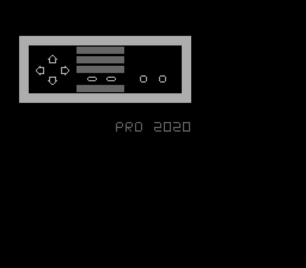

# NES Controller Demo

[Screencap on YouTube](https://youtu.be/aEUPRPAZDXE)

## What?
This repository contains the source code and ROM for a "game" I put together in
order to learn more about 6502 Assembly and the NES platform.

The "game" contains a mock NES controller which reacts to button presses.

## Why
This isn't a very _fun_ game but it covered enough ground for me to get a feel
for what writing and NES game is like:
- starting the system in a clean state
- creating and configuring color palettes
- creating and configuring sprites and background images
- reading from a controller
- updating the UI in response to controller input

## How?

#### Dependencies
- [cc65](https://www.cc65.org/) compiler/toolchain
- [FCEUX](http://fceux.com/web/home.html) emulator (any emulator should do but this one is assumed)
- [nestool](https://github.com/jpwhiting/nestool)

#### Build
##### `make`
The default make target will compile and link the source files and generate a
ROM file.
##### `make run`
The `run` make target will build the ROM and open it in the FCEUX emulator

## TODO
- add sound effect(s)
- add button press counters
- add start screen
- experiment with scrolling/interactive background

## Resources
The souce code borrows _HEAVILY_ from Famicom Party and Zero Pages. Famicom
Party is released under the Creative Commons
Attribution-NonCommercial-ShareAlike 4.0 license and Zero Pages does not
include a license, so this project will be adopting the Famicom Party CC
license. Full credit to those two authors, where applicable, though. They're
both excellent resources and this would have taken much longer to put together
without them.

- [Famicom Party](https://famicom.party/)
- [NESDev Wiki](http://wiki.nesdev.com/w/index.php/Nesdev_Wiki)
- [Zero Pages](https://www.youtube.com/watch?v=JgdcGcJga4w&list=PL29OkqO3wUxzOmjc0VKcdiNPqwliHEuEk)
